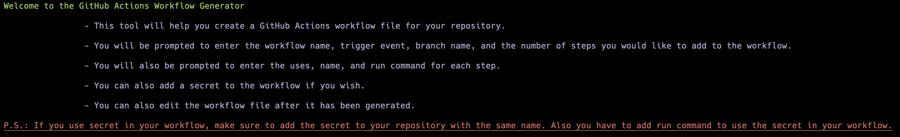
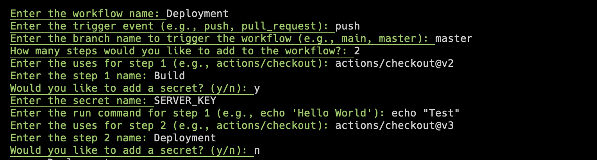
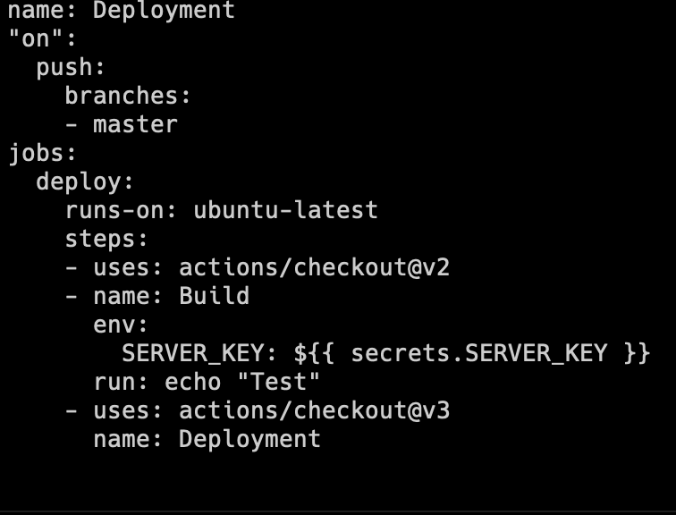

## Yml Generator for Github Actions

This is a simple tool that generates Github Actions yml file using user inputs. This project uses "gopkg.in/yaml.v2" for golang struct to yml conversion.

## Screenshots

1. Welcome Screen

2. User Inputs

3. Generated Yml

## LICENSE

[MIT LICENSE](LICENSE)